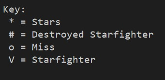
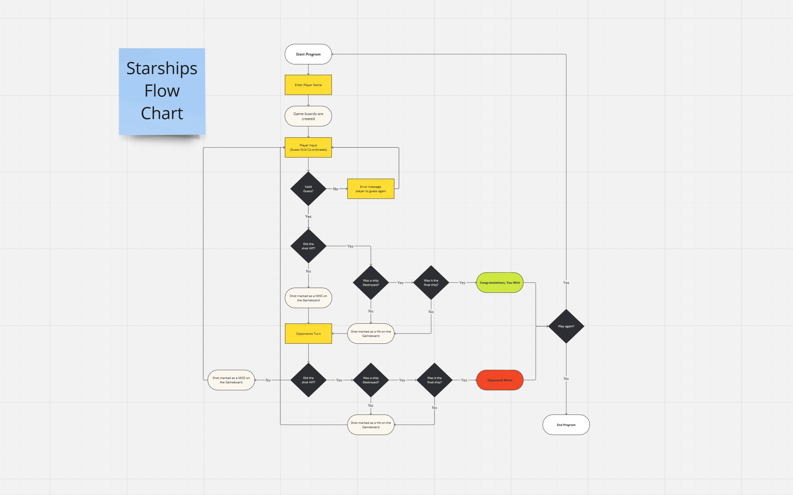
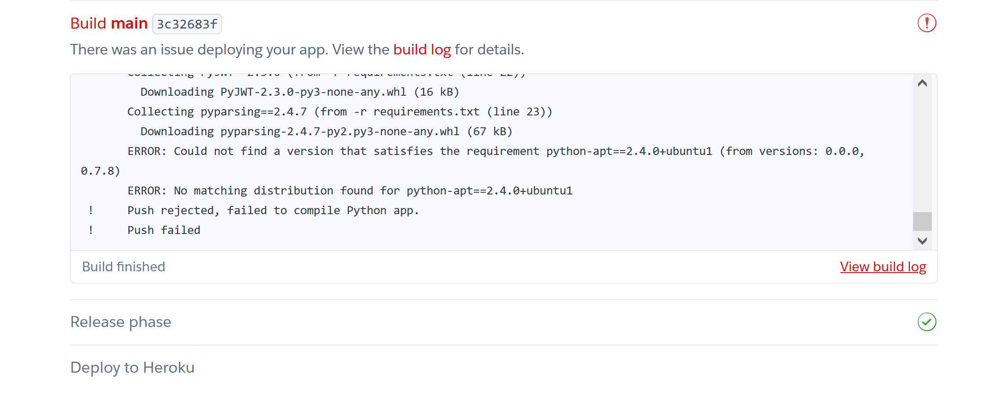
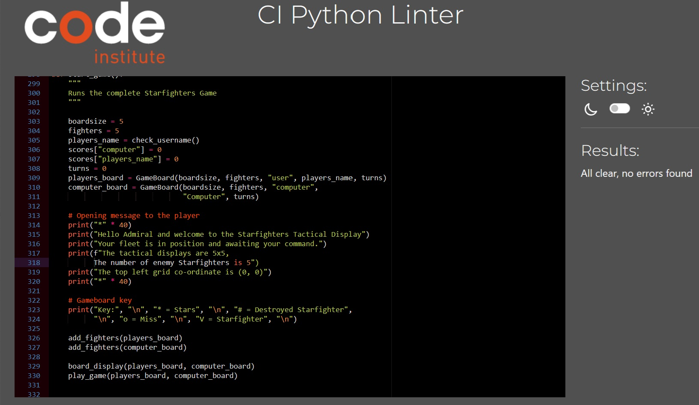
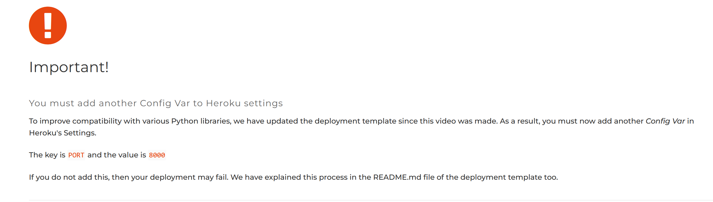
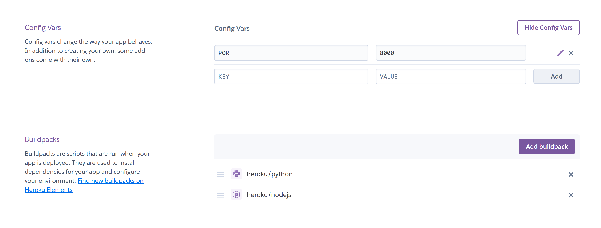

* Welcome to Starfighters

Starfighters is a single player, turn based strategy game set in the depths of space. As Admiral, your mission is to discover and destroy the hidden enemy Starfighter fleet before your own fleet of five Starfighters is destroyed.

The enemy Admiral has hidden their fleet within this star systems nebula cloud, and their precise location cannot be detected. Your only hope is to map your shots onto your tactical display and record the results of shot co-ordinates, misses and destroyed Starfighters. All it takes is one direct hit to destroy a Starfighter, so speed and accuracy is of the most importance.

Best of luck Admiral.

A link to the live Starfighters program can be found here: [Starfighters](https://starfighters-807e54892406.herokuapp.com/)

** How to Play

This current version of Starfighters, is written using the Python programming language and using the imported Python module of random. Starfighters is a turn by turn,single player game which requires the player to input a guess against the Computers gameboard, with the desired result of destroying all their Starfighters. The player is given two gameboards which use a 5x5 grid, with the top left of the gameboard having an input of (0,0) and the final space in the lower right corner of the gameboard being (4,4). The top gameboard shows the players name and contains their Starfighters, whilst recording the outcome of the moves from the computer. The lower gameboard is the Computers Starfighters gameboard, this contains the computers hidden Starfighters and is where the player inputs are recorded. The resulting inputs from both the player and computer will result in one of two outcomes either a hit which will Destroy a Starfighter, or a Miss. With a miss having statistically a higher outcome in the earlier stages of the game as there are more empty spaces than spaces containing Starfighters.

The game begins after the player has input their name, the game boards are created then using Pythons random module the players and computers Starfighters are placed at random over the two corresponding game boards which are then displayed to the player. The game will then ask the player to input their first guess and record the outcome. It is then passed over to the computer to do the same. This turn by turn process is repeated until either the players or computers five Starfighters have been destroyed. With the game finalising in a message to the player, if victory conditions for the player is met a congratulatory message is displayed, or a message of commiserations if the player is defeated by the computer. 

Starfighters is a game for those who enjoy the original Battlship game, turn based strategy games and games that have involve the space/sci-fi genre. 

- A brief History 

Starfighters is a single player game based on the classic pen and paper game of Battleships. In the original Battleships game the player is given two 10x10 grids. The first grid is used for the placement of the players five Battleships of varying sizes, and to mark the opponents shots against the player's ships. The second grid is used to mark down the players shot against the enemy ships and to record the outcome of a players turn. Turns for both the player and their opponent will result in a shot either hitting or missing a ship or resulting in a Battleship being sunk. The size of the ship determines the required amount of hits before a Battleship is sunk.

The classes of naval ships used in the original game were:

- Carrier (5 grid spaces)
- Battleship (4 grid spaces)
- Cruiser (3 grid spaces)
- Submarine (3 grid spaces)
- Destroyer (2 grid spaces)

Due to different publications of the game Battleships found around the games name, ship names, sizes and gameboards can vary. But the overall objecting resulting in the same outcome.

- More information on the game Battleships can be found at [link to wikipedia.com](https://en.wikipedia.org/wiki/Battleship_game)

In my version Starfighters, the classic Naval game has been given a sci-fi twist, transporting the game into the cosmos and setting the turn based action amongst the stars.

** Features

- Game Design

The classic grid design from the game Battleships was used. This allows for clear placement of Starfighters, and recording the players shots. A 5x5 grid size allows for a decent sized game board to accomodate single space sized Starfighters.

- In game Key:
        * = Stars (empty spaces)
        # = Destroyed Starfighters
        o = Miss
        V = Starfighter

To help with player immersion instead of empty spaces on the gameboard, I have tried to recreate the stars using the asterisk key (*) due its star shaped properties.

A capitalised V was used as Starfighters, with the pilots cockpit imagned being at the bottom of the V, whilst the top of the V being front end of the fighter.

The Hashtag key (#) is used to symbolise the destruction of the Starfighters.

A guess that has been registered as a Miss is displayed with a lower case O (o).

- Future Improvements:

The ability for the player to choose between the game's set standard 5x5 or larger grid sizes, such as 8x8 and 10x10.

The ability for the player to set their own starfighter positions on their tactical grid.

Larger Starfighters the use multiple grid spaces, and requiring more hits to result in being Destroyed.

A variety of Starfighter size options that can be placed on the gameboard. 

Max amount of the larger Starfighters would only be available to the player when playing on the 10x10 grid.

Difficulty option for the player to set the number of enemy ships to allow for increased or decreased game difficulty.

The use of an outside library such as colorama to introduce some colour and futher design into the game.

Introduce a replay game function to allow the player to reset the game, and play a new game of Starfighters.

These future improvements and implementations are desgined give the player more options and enhanced and more enjoyable gameplay. 

** Gameplay Logic

The below flow diagram showing the intended gameplay loop of how the game runs from Start to Finish.

There is an extra step within the flow diagram that it not currently present within the game, asking a yes/no statement of "Was a ship Destroyed". This has not yet been ammended as changes in the way the game is run from it's original conception, and a case of time best spent in other areas reworking this project for re-submission.

The game play logic follows a series of yes/no statements after the creation of the game boards. 

Starting with asking the question if the player or computer has input grid co-oridinates that matches that fits within the game boards 5x5 grid size. If No, the player/computer is looped back to the enter co-ordinates until a correct entry is recieved. This also checks for grid co-ordinates that have been previously entered. If yes then the gameplay is moved along to the next check.

The check following a correct co-ordinate input, will then see if the players/computers guess will register that shot against a Starfighter as being Destroyed or Missed, then the game play loop will then check to see that if a Starfighter has resulted in being destroyed, if not it will pass over to allow for the computer to take a turn and guess, where the same checks will be performed, and update the gameboards and display them accordingly back to the player.

This loop continues to run until either a check has been made until either the player or the computer has destroyed the final Starfighter on board, and display the corresponding end of game message. It will then ask the player if they would like replay the game again or to quit the game.

** Technologies Used

Starfighters was written using the Python programming language.

** Testing

*** Bugs

- Solved Bugs

Issue found when trying to deploy my app on Heroku. I needed to reach out to Tutor Support for advice, the bug could have be an issue from using the pip3freeze command while composing my app on codeanywhere. Sean from Tutor Support, suggested to remove the installed packages and to re try deployment with a new set of packages. Once replacing what was suggested as the issue and attempted re-ployment on Heroku, the apps deployment was finally complete. Further information on this bug can be found in the credit section at the end of the README.

A previous verision bug would occur when testing the Hit, Miss, Destroyed markers against the board whilst in early development. Once the final shot on a ship was destroyed and game was completed. All remaining empty spaces would change to the Destroyed marker.

The issue found due to a mispelling and once corrected, the code would run as designed. The Destroyed element was eventually removed in this current iteration of Starfighters, due to design choice of the game overall. Preferring to use a smaller grid board and smaller sized ships, for game optimization when being played. It would be my intention in a future update to bring back the destroyed marker into the game.

While in development of a previous version of Starfighters there had been issues regarding the random placement of larger ships, that would result in Starfighters exiting the edge of the gameboard, and finishing at the beginning of the next row. Resulting in the Starfighters being split. 

Also the larger sized Starfighter random placement, being placed outside of the confines of the planned grid size, and the larger sized Starfighters also overlapping within the same grid space. The larger design Starfighters was eventually dropped from the current version of this game. But with a future plan to reintroduce them in a future release.

- Remaining Bugs

Although not code related, within the Gitpod terminal it displays a problem regarding the ms-python.debugpy extension. I did not have time to find a way to remove the issue, however I think it may be related with transferring over the workspace from CodeAnywhere to Gitpod.

*** Validation

- PEP8

All PEP8 checks passed via the CI Python Linter Checker

** Deployement

- Deployment to Heroku

Ensure all relevant packages for project are installed, and make any final commits and push the update through to Github.

Create or Sign in to your Heroku account.

Click on the Create App option and give your App a name for your deployment, then selcet your region from the provided drop down box. As App names need to be unique, there maybe a possibility that your preferred name may already be taken. If that is the case, take a moment to think of a new name.

Whilst on the main project page, there are a extra steps to take on the Heroku platform before we can deploy our app. Which can be done by going to the settings tab. 

Underneath App Information, you will find Config Vars.

Click on the reveal Config Vars button, within the KEY box, add PORT and then add 8000 to the VALUE box. Then click add.
This is done to due to a warning found on the Deploying our Project Part 2, video page. As it was found by not adding this there was a possibility that the deployment may fail.

Afterwards we need to turn our attention to installing some buildpacks we need to run our app outside of the requirements.txt file. First we want to install the python buildpack, followed by the node.js buildpack, then click the add buildpack button.

Once the buildpacks have been added, scroll back to the top of the page and head over to the deployment page, by clicking on the Deploy tab.

Within the Deployment Method, we will select Github as our deployment method by clicking on the Github option, then click the Connect to Github button below. This will connect to our Github repository and allow us to proceed to the next step.

Below we will find the App connected to GitHub section. Enter the name of the project repository in the search bar and click the search button. Once the project's repository is found, we can then click the connect button to link our Heroku app with the code found in the Github project repository.

Afterwards proceed to scroll down the page and choose if would prefer Automatic or Manual Deployment. We select automatic so that any further Git commit and push's on the project can be automatically deployed.

Finally below at the end of the page we have reached the Manual Deploy section where we click on the Deploy Branch button so that we can initiate our apps deployment.

** Forking and Cloning

- How to Fork the repository:

Log into Github.

Go to the repository for this project, (https://github.com/TobyJef/starfighers)

Click the Fork button found on the right of the page underneath the upper navigation bar.

- How to Clone the repository:

Log into GitHub.

Go to the repository for this project, (https://github.com/TobyJef/starfighters)

Click on the code button, select whether you would like to clone with HTTPS, SSH or GitHub CLI and copy the link shown.

Open a terminal in your code editor type 'git clone' into the terminal and then paste the link you copied from the Github repository. Press enter to change the current working directory to the location you want to use for the cloned directory. 

** Credits

- Sean from Tutor Support.

 I reached out to Tutor Support after I attempted to deploy this project on Heroku. Whilst following through the Deploying our Project, Part 1 video from the Love Sandwiches Walkthrough project as reference, upon my first attempt at deployment, the deployment failed due to the below error:

ERROR: Could not find a version that satisfies the requirement python-apt==2.4.0+ubuntu1 (from versions: 0.0.0, 0.7.8)
ERROR: No matching distribution found for python-apt==2.4.0+ubuntu1
! Push rejected, failed to compile Python app.
! Push failed.

Before finishing work on my project for the night I sent an out of hours message off to Tutor Support to ask for some assistance,
as after searching resources such as Stack Overflow and the code institute community channels within Slack. I was yet to find a solution that fixed the issue, although other students appeared to have the same problem.

When I resumed work on this project the following morining I had a reply from Sean, who suggested that after looking at the Starfighters repository, Sean believed that the issue was possibly caused from using the pip3 freeze > requirements.txt whilst constructing my project on Code Anywhere and that by using the pip3 freeze > requirements.txt had installed unnecessary packages into the program, which has caused the error. Sean suggested that a possible fix would be to, replace the packages with those found currently in the requirements.txt file and to try redeployment again.

After following Seans instructions and attempting redeployment on Heroku, the deployment was successful.

- Final Commit and Push occured on 21/5/24 at 
